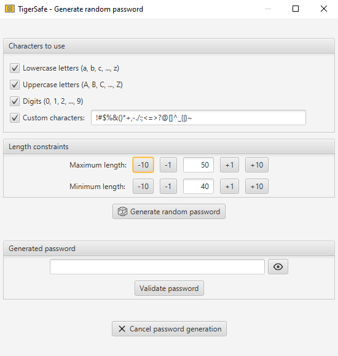

#  TigerSafe

TigerSafe is a free open source password manager.\
It aims at storing sensitive data as securely as possible, keeping in mind that security is never guaranteed, is relative to threats, and is limited by the execution environment.

## Features

This software currently has the following features:
 - **Store passwords (and additional data)** in a file encrypted with a single password, without an internet connection.
 - **Generate random passwords** with full customization options (minimum and maximum length, characters that can be used).
   
   

 - Store **TOTP tokens** (**2FA**, two-factor authentication used by most websites) and display current and next authentication codes.
   
   

 - **Review interface** for stored data changes that are not yet saved, displaying all additions, modifications and deletions of stored data, and allowing to cancel them when needed.
   
   

 - Edit mode and save action (required to apply all unsaved changes to the safe file) with a confirmation popup, **preventing accidental data loss**.
 - **Search** password entries by their name and/or website.
 - **Any language** support (almost all displayed text can be modified).
 - JavaFX **CSS support**, allowing to customize the graphical interface.
 - Configurable **keyboard shortcuts**, allowing to efficiently (potentially without any click) use the software.
 - Selectable encryption algorithms for encryption and decryption of safe files, including authenticated encryption algorithms, among others.
 - Interface to change the main password and the encryption algorithms of a safe file.
 - Import and export safe data, allowing to **easily migrate from an old version of TigerSafe to a newer** (exported data is stored in an encrypted file to maintain data security).
 - Display of a description for most fields when hovering over them, helping to understand the software.

### Coming soon...

The following features are planned to be developed:
 - Chromium browser extension for quick and secure retrieval of passwords.
 - Manage SSH keys
 - Manage GPG keys
 - Store any type of file

## User guide

Installation instructions: https://github.com/tigeriodev/tigersafe/wiki/Installation-instructions \
User tutorial: https://github.com/tigeriodev/tigersafe/wiki/User-tutorial

## Security

Perfection doesn't exist. This software is not perfect, but its goal is to try to be as secure as possible for most users.

TigerSafe stores safe data in a file, encrypted with the selected encryption algorithms and the main password.\
Therefore, to steal the safe data, a hacker would need to get access to the safe file, and to know/find the encryption password (and the encryption algorithms, which are available in the global config file of TigerSafe, and therefore are not a protected information) (and by what version of TigerSafe the safe file was encrypted).

Available encryption algorithms are based on the implementation of Java, and their parameters are not customizable for security reasons.\
The encryption process of TigerSafe is deliberately non-standard and complex to make hacking more difficult.\
The user can choose to use authenticated encryption algorithms, which allows to detect if the safe file has been modified manually (without decrypting it, i.e. without using the main password, i.e. by an unauthorized person/software), but could leak some information on the main password or could facilitate hacker attacks. To compensate that, TigerSafe allows to configure 2 different encryption algorithms: one for the stored data (the data that the user wants to keep), and another for internal data (used to encrypt/decrypt stored data).

When saving modifications of safe data in the safe file, a temporary encrypted file is created, then decrypted to check if all (new) safe data is readable.\
If there is any issue, the original safe file (which contains old safe data) is kept unchanged (and the temporary file is deleted). Otherwise, the temporary file replaces the old safe file.\
This reduces the risks of data loss, ensuring that the safe file is always readable and stores expected data.

TigerSafe tries not to trust anything outside of its implementation.\
For example, the encryption algorithms, which are based on the Java implementation, are checked before any encryption, to avoid for example storing sensitive data with an algorithm that would not work correctly because of a problem in the execution environment, and would therefore silently compromise security. Their parameters cannot be customized for security reasons.\
A custom encryption algorithm cannot be configured for security reasons.\
The global config file, which contains the selected encryption algorithms, is only loaded at the launch of TigerSafe, and any modification is ignored (dynamic loading is not supported for security reasons). This config file contains only non-sensitive data, needed for decryption and/or with no dangerous impact on the stored data. Its parameters are stored in a file and not provided in the command line to be dynamically changed when using the software, and to facilitate user configuration.\
Added to that, TigerSafe has only one dependency (JavaFX, for GUI, originally developed by the Java team). The fact that it doesn't use several dependencies considerably reduces the risks of security flaws.

Unfortunately, Java doesn't offer total control over heap memory, doesn't erase bytes of discarded instances fields (the memory space is just made available), and can duplicate some fields value.\
To mitigate these issues, some Java and JavaFX implementation classes are improved with reflection or rewritten with a totally different implementation in TigerSafe.\
Some techniques are used to erase as much sensitive data as possible, and in particular a big heap memory erasing is attempted when terminating the program.\
This is why TigerSafe requires some `--add-opens` arguments only for some of its modules, and why TigerSafe should be executed with a heap memory of fixed size (same value for `-Xms` and `-Xmx` JVM arguments).\
Most of the time, sensitive data should be fully erased from the computer memory before TigerSafe is terminated. In the event that it wouldn't be the case, we can hope that the OS would clear that memory before allowing another process to read it, and if it doesn't do it, we can hope that malwares installed on the computer would not get the full old memory used by TigerSafe (they could for example only get a portion of it, which would probably be insufficient to retrieve useful data), and we could also hope that these malwares don't know TigerSafe, and therefore don't know how to take advantage of the data they would eventually succeed to retrieve.

For maintainability reasons, TigerSafe has a logging mechanism. However, for security reasons, this mechanism is non-standard, can only be enabled at the launch of the software, and when unsafe loggers are enabled a warning popup is displayed to avoid a sneaky activation.

There is no (known) backdoor.\
There is no (known) way of restoring data if the main password of a safe file has been lost, except by brute forcing (trying all possible passwords until finding the right one).

There is no backup mechanism for the safe file.\
If the safe file is modified outside of TigerSafe, the stored data will probably be lost.\
If the safe file is lost, its data is lost (TigerSafe has no mechanism allowing to upload the safe file to a remote server, it is the responsibility of the user to decide how to backup his safe file).

TigerSafe features are voluntarily simple, focused on essential needs, to make it easy to maintain, test and therefore secure.\
Automatic tests are written to ensure some stability and security.

### Windows

Since the processes of a Windows user can access the memory of other processes of that same user, a special installation is required to protect sensitive data stored in TigerSafe.\
This special installation makes it possible to execute TigerSafe with a special (non admin) Windows user, which should only be able to execute TigerSafe (no other processes).\
In order to reduce the exposition of Windows administrators password (when they type it) and to make the execution of TigerSafe easy, this installation is made in a way that any Windows user (even non admin, even without admin privileges) can execute TigerSafe securely.

This setup involves the use of a special Windows service, which has the role to allow only one process at a time to be launched on the special Windows user dedicated to TigerSafe execution.\
The setup also sets TigerSafe processes permissions to minimal, which should prevent tools/debuggers/malwares to access memory without admin privileges.\
Concretly, when TigerSafe is being executed on the special Windows user, no other processes (including malwares), should be able to be executed on that Windows user. And even if a process succeeded to be launched on that Windows user, it should not have the Windows permissions to access the heap memory of TigerSafe, and should be detected by the monitoring mechanism of TigerSafe, as explained in the following paragraph.

TigerSafe has a processes monitoring mechanism, which allows to check if unexpected processes are being executed on the same OS user at the same time that TigerSafe is being used. This mechanism is configured in Windows to detect any unexpected process that would be executed on the special Windows user while TigerSafe is being executed, and TigerSafe should automatically close itself when it finds one.\
This is an additional security layer, at the TigerSafe Java program level, to reduce the risks of a malware that would succeed to access the heap memory of TigerSafe. And since this mechanism is directly in TigerSafe, the auto-closing is smooth and cannot be easily bypassed, contrary to a hard TerminateProcess instruction that could be sent by a special monitoring external process.

The executables of this special Windows installation for TigerSafe are signed with a self-signed auto-generated certificate, which is destroyed (its private key) just after the installation. This ensures integrity of the launching process of TigerSafe.\
The installation is protected with a locking mechanism, that has the role to manage read-only attributes and Windows permissions of all the installed files of TigerSafe for Windows (but this locking mechanism can be disabled with admin privileges when needed, to change the parameters of TigerSafe for example).

However, despite all the previously mentioned security aspects, this special installation of TigerSafe for Windows cannot withstand a hacked Windows OS. In other words, if a malware has admin privileges on a computer where TigerSafe is installed, it can potentially access memory of TigerSafe, and therefore data stored in TigerSafe if an user has opened a TigerSafe safe file.\
A malware with admin privileges could even just replace the official installation of TigerSafe with a malware that looks like TigerSafe. If the user is not vigilant, he could therefore execute a malware instead of the real TigerSafe software.\
Therefore, TigerSafe should only be used on a computer you own and trust.

## Authenticity

The first version of TigerSafe was released on 16/01/2025 by tigeriodev.\
tigeriodev is identified as the holder of the private keys corresponding to the GPG public keys stored in the `tigeriodev-public-keys.asc` ASCII file in the `authenticity` directory of this project.\
All the commits and tags of tigeriodev in this project are signed with the previous GPG private keys.

## Legal information

Legal information is available in the `NOTICE` and `LICENSE` ASCII files of this project, as well as by clicking the `About` button in the software's initial graphical interface.